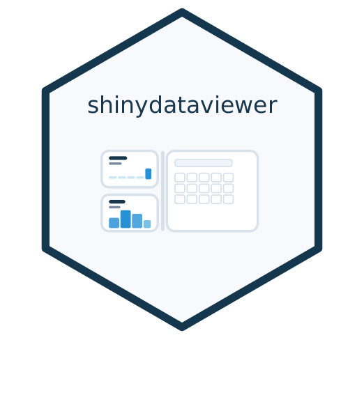
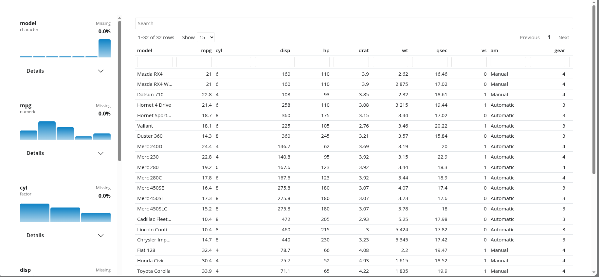

<!-- README.md is generated from README.Rmd. Please edit that file -->

```{r, include = FALSE}
knitr::opts_chunk$set(
  collapse = TRUE,
  comment = "#>",
  fig.path = "man/figures/README-",
  out.width = "100%"
)
```

# shinydataviewer 

<!-- badges: start -->
[](https://github.com/Ryan-W-Harrison/shinydataviewer/actions/workflows/R-CMD-check.yaml)
<!-- badges: end -->

shinydataviewer provides a reusable Shiny module for viewing tabular data
with a searchable table and a variable summary sidebar inspired by the Positron
data viewer.

<p align="center">
  
</p>

## Installation

When `shinydataviewer` is available on CRAN, install it with:

```{r, eval=FALSE, echo=TRUE}
install.packages("shinydataviewer")
```

Until then, you can install the development version from GitHub:

```{r, eval=FALSE, echo=TRUE}
pak::pak("Ryan-W-Harrison/shinydataviewer")
```

## Package interface

The package is designed to be used as a reusable Shiny module. The main exported
functions are:

- `data_viewer_ui(id)`
- `data_viewer_server(id, data)`
- `data_viewer_card_ui(id, title = NULL)`
- `summarize_columns(df)`

`data` should be a reactive expression that returns a `data.frame`.
Supported column classes are numeric, integer, character, factor, logical,
`Date`, and `POSIXct`/`POSIXt`.

## Minimal module example

Use the module directly when you want the viewer layout to manage its own main
table region:

```{r, eval = FALSE}
library(shiny)
library(bslib)
library(shinydataviewer)

ui <- page_fillable(
  theme = bs_theme(version = 5),
  data_viewer_ui("viewer")
)

server <- function(input, output, session) {
  data_viewer_server(
    "viewer",
    data = reactive(iris)
  )
}

shinyApp(ui, server)
```

## Embedded card example

Use `data_viewer_card_ui()` when the viewer needs to live inside a larger
dashboard or reporting layout:

```{r, eval = FALSE}
library(shiny)
library(bslib)
library(shinydataviewer)

ui <- page_fillable(
  theme = bs_theme(version = 5),
  layout_columns(
    col_widths = c(4, 8),
    card(
      card_header("Context"),
      card_body("Supporting content goes here.")
    ),
    card(
      card_header("Dataset"),
      card_body(
        fill = TRUE,
        data_viewer_card_ui("viewer", title = NULL, full_screen = FALSE)
      )
    )
  )
)

server <- function(input, output, session) {
  data_viewer_server(
    "viewer",
    data = reactive(mtcars)
  )
}

shinyApp(ui, server)
```

An additional runnable example is included at
`inst/examples/embedded-card-example.R`.

## Theming and branding

The viewer styles are attached as a package dependency and use Bootstrap 5
theme variables instead of fixed colors. In practice, that means the module will
follow the active `bslib` theme and should pick up branding supplied through
`bs_theme()` or a `brand.yml`-driven theme without additional module-specific
configuration.

```{r, eval = FALSE}
ui <- page_fillable(
  theme = bs_theme(
    version = 5,
    brand = "brand.yml"
  ),
  data_viewer_card_ui("viewer")
)
```

## Data summary helper

If you want access to the same summary data used by the module's variable panel,
you can call `summarize_columns()` directly:

```{r, eval = FALSE}
summarize_columns(iris)
```

The returned data frame has one row per input column. Its `summary_stats` and
`distribution_data` list-columns contain the same precomputed payloads used by
the sidebar cards, including compact statistics, histogram bins, and top-level
categorical counts.

## About

You are reading documentation for version `r read.dcf("DESCRIPTION")[1, "Version"]`.
